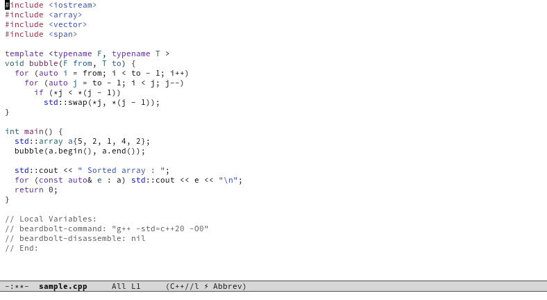

# Beardbolt



A fork-rewrite of [RMSbolt](https://gitlab.com/jgkamat/rmsbolt),
itself a supercharged implementation of [Godbolt, the
Compiler Explorer](https://github.com/mattgodbolt/compiler-explorer)
but for Emacs, instead of a clunky browser.

Beardbolt shows assembly output for given source code file, making it
easy to see what the compiler is doing.

It also highlights which source code corresponds to a given assembly,
and vice versa.

### Why Beardbolt over RMSbolt

- 3-5x faster on typical files, more on larger files.  See [here for
  benchmarks](#benchmarks).
- Doesn't require file to be saved.
- 🌈Has pretty rainbows🌈
- Has useful Godbolt features like "execute program" and
  "preserve/filter library functions" .
- Simpler code (less than half the LOC, though less funcional in some
  regards if we're honest).

### Why RMSbolt over Beardbolt

- Supports way more languages/compilers. Beardbolt only C, C++ and Rust.
- Supports more Emacs versions.  Beardbolt probably only 28+

### Installation

```sh
cd /path/to/beardbolt/clone
make
```

```lisp
(add-to-list 'load-path "/path/to/beardbolt/clone")
(require 'beardbolt)
```

```
M-x beardbolt-starter
```

### Main commands

* `beardbolt-starter`: Lets you start a new experiment in one of the
  supported languages.  Automatically start `beardbolt-mode`.
  
* `beardbolt-mode`: Starts a minor mode that automatically re-compiles
  buffer code every few changes to the source code.
  
* `beardbolt-compile`: Manually start a compilation.  Bound to `C-c
  C-c` in `beardbolt-mode`.

### Options as local variables

Beardbolt's behaviour can be tweaked with some options that more or
less correspond to the ones of Compiler Explorer.  You may set them
globally (they're normal Emacs customization variables), but they're
probably more useful as file-local cookies, like you see in the
animated gif above.

Beardbolt will pick them up immediately on each run.

* `beardbolt-command`: Main compiler command to run.  May be something like
  `"gcc -O3"`.  Leave unset to have Beardbolt try to guess from some
  nearby `compilation_commands.json`.

* `beardbolt-disassemble`: Compile, assemble, then disassemble using
  `objdump` and present that input instead of assembly code.
  
* `beardbolt-asm-format`: Choose between `intel` and `att` formats.

* `beardbolt-preserve-directives`: Keep every non-code, non-label asm
  directive.
  
* `beardbolt-preserve-unused-labels`: Keep unused asm labels.

* `beardbolt-preserve-library-functions`: Keep functions with no code
  related to current file.
  
* `beardbolt-demangle`: Demangle any mangled symbols of resulting
  assembly with `c++filt`.
  
* `beardbolt-execute`: If non-nil, run the resulting program in the
  compilation buffer.  If a string, run with these arguments.  If `t`,
  runs without arguments.
  
* `beardbolt-ccj-extra-flags`: A string of extra compilation flags to
  append to the compilation command devined from
  `compile_commands.json`.
  
* `beardbolt-shuffle-rainbow`: Use less pretty rainbow colors, but
  potentially more useful and contrasting ones.

<a name="benchmarks"></a>
### Benchmarks vs RMSbolt

First, a word on what "fast" means.  The performance metric to
optimize is responsiveness: the goal is not only to provide this a
live view of the assembly output as quickly as possible, and also to
intrude as little as possible in the user's editing.

Both Beardbolt and RMSbolt extensions work in a two-step fashion.
Most of the speed gains of Beardbolt happen in step 2.

1. The file is saved somewhere and partially compiled by an external
   program

   This happens asynchronously.  It might takes several seconds and
   spin up your CPU, but it does not generally harm the UX inside
   Emacs.

2. Some Elisp processing takes place on the assembly output

   This happens inside Emacs, and it's generally bad if it takes a
   long time, because Emacs is single-threaded and has no easily
   accessible asynchronous mechanisms for this type of work.

#### Results

To run the benchmarks, have both RMSbolt and Beardbolt clones
side-by-side, then:

```
$ cd /path/to/beardbolt/clone
$ EMACS=~/Source/Emacs/emacs/src/emacs make benchmark
/home/capitaomorte/Source/Emacs/emacs/src/emacs -Q -L . --batch -l beardbolt-benchmark starters/slow-to-process.cpp
RMSbolt timings for slow-to-process.cpp
  samples: (1.329s 1.316s 1.338s 1.345s 1.341s)
  average: 1.334s
Beardbolt timings for slow-to-process.cpp
  samples: (0.324s 0.338s 0.334s 0.334s 0.342s)
  average: 0.334s
/home/capitaomorte/Source/Emacs/emacs/src/emacs -Q -L . --batch -l beardbolt-benchmark starters/vector-emplace-back.cpp
RMSbolt timings for vector-emplace-back.cpp
  samples: (0.234s 0.223s 0.223s 0.240s 0.224s)
  average: 0.229s
Beardbolt timings for vector-emplace-back.cpp
  samples: (0.086s 0.074s 0.073s 0.074s 0.089s)
  average: 0.079s
/home/capitaomorte/Source/Emacs/emacs/src/emacs -Q -L . --batch -l beardbolt-benchmark starters/unordered-multimap-emplace.cpp
RMSbolt timings for unordered-multimap-emplace.cpp
  samples: (0.534s 0.523s 0.524s 0.523s 0.529s)
  average: 0.527s
Beardbolt timings for unordered-multimap-emplace.cpp
  samples: (0.103s 0.123s 0.103s 0.102s 0.118s)
  average: 0.110s
```

This ran `beardbolt-compile` and `rmsbolt-compile` 5 times on small
two [cppreference.com](https://cppreference.com) examples
([1][example1], [2][example2]) as well as a known "slow" file found in
[RMSbolt's bug tracker](https://gitlab.com/jgkamat/rmsbolt/-/issues/9).

To make the benchmark fair(er?) I patched `rmsbolt.el` to generate
slightly less debug with `-g1` instead of `-g`, and thus benefit from
the same speedup that `beardbolt.el`.

The results were obtained on my Thinkpad T480 running Emacs 29
(without native compilation).

[example1]: https://en.cppreference.com/w/cpp/container/vector/emplace_back
[example2]: https://en.cppreference.com/w/cpp/container/unordered_multimap/emplace
